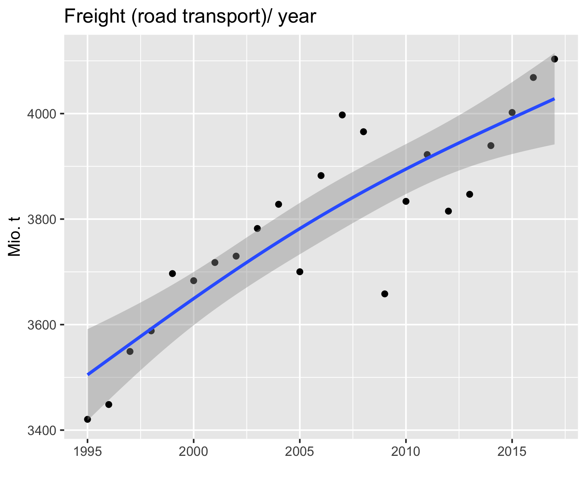

```{r setup, include=FALSE}
knitr::opts_chunk$set(echo = TRUE)
```
## Emission data of greenhousegases (ghg) published by UBA
German emission data of greenhouse gases are published by the German  government agency (UBA) and may be downloaded from this url:
url_emissions<- "https://www.umweltbundesamt.de/sites/default/files/medien/361/dokumente/2021_03_10_trendtabellen_thg_nach_sektoren_v1.0.xlsx" : 

In 1990 total emitted CO2 from human activities was 1.074.783.000 t which was reduced until 2020 to 644.454.000 t that was a reduction by 40%.
Traffic (Air,road, rail and ship) caused 160.844.000 t in 1990 reduced to 143.730.000 in 2020 a reduction of 11% although mileage and freight increased dramatically.
Emissions of road traffic (all sectors) decreased from 151.886.000 $t$ to 140.582.000$t$ a reduction of 7.5%.

Road traffic causes about 22% of total $CO_2$ emissions.
This has to be seen with respect to the total mileage and load transported:
In 2014 the total mileage of road vehicles was 707.803.279.000 $km$ and increased to 733.013.937.000 $km$.

On the European level the figure shows the contribution of the various sectors to the $CO_2$ emissions:
<div style="display:block">Passenger cars in 2016 caused 60% of $CO_2$-traffic emissions  that was about 95 Mio.t. Heavy duty trucks 26%.

The goal is to reduce traffic emissions by 60% of  1990 values in 2050. Part of this the freight transport transmissions shall be reduced by 30% in 2050.

Heavy duty transport (SNF) in tons per km $[tkm]$ is steadily increasing:


There is no official forecast on the future development of road freight in Germany available. The red dots represent a scenario  published by the German Ministry for Transport and Infrastructure in 2007 which leads to more than 800 Billion $tkm$ in 2050.The black dots are real anual values recorded up to 2017. They suggest that the 2007 scenarion was verxpessimistic. The blue line an interpolation of the real data may be more realistic suggesting an upper limit at about 500 to 600 Billion $tkm$.
*Technology reduced specific $CO_2$-emissions by  ~ 30% :*


Freight transport correlates with gross domestic product and is measured in ton*km. This development is driven by three main factors:  


--  the increase of transported goods and distance 
--  technologies to increase efficiency
--  technologies to reduce exhaust gas emissions

Increased efficiency  reduce fuel consumption this means lower CO2  emissions, but exhaust aftrertreatment (e.g. $NO_2$ and particles $PM 10 ,PM2.5$) lead to higher fuel consumption and therefor increased $CO_2$ emissions.

The combined effect of these factors results in a strong trend to increase freight transport emissions:


##  Scenario for future road transport



Freight transportation depends on future development of gross domestic product and the distance traveled by the goods. Both factors did increase in the past as shown from 1995 to 2019 as black dots, but the trend depends  on **non predictable events** as e.g. the corona pandemic or  recessions (as in 2008). There is also a limit to growth. Two scenarios are considered: 
*  A study from Prognos published 2007 by the German ministry for transportation and infrastructure assumed an increase to 800 Mio.tkm in 2050 (red line).
* The development after the financial crisisi in 2007/08  suggest an upper limit about 600 Mio. tkm (green line). 

This is an optimistic scenario with respect to $CO_2$-emission. 

Simulated freight scenario  | 

##  Estimating CO2 Emission of Existing  Passenger Cars in Germany
Total emission of $CO_2$ related to *transport* was $142,2 Mio.t$ in 2020 total emissions was 858 Mio. t  Trafic data are published by the Kraftfahr Bundesamt (KBA). In 2020 the total mileage of passenger cars was reported to be  $626 * 10^9 km$. There are several estimates for the real emissions dependent on the test cycle used. The highest values published by ICCT as "real emissions for new vehicles". A plausible mean value for the existing fleet may be obtained by estimating older data by a factor of roughly + 17% to take care of the higher values measured by the WLTP for new cars.
The emissions of the fleet are the calculated as the mean of all new cars registered between 1998 and 2018. This results in $179 g/km CO_2$.Estimating the *yearly emissions* of the *German passenger car fleet* to $113 Mio.t  CO_2$ which is 70 % of transport emissions in 2018.
```{r}

```

### Replacement of Passenger Cars

In 2021 in Germany 48 Million passenger cars were operated. Of these about 2.9 Million (6%) were replaced by new cars. Of all new cars  0.6% were Battery Electric Vehicles (BEV) and 2.1% Hybrid Electric cars. Even with a very high rate of replacement cars $CO_2$-emissions are caused mainly by existing fleet. 
As it is not feasible to replace all existing passenger cars immediately the rate of $CO_2$ reduction depends on the renewal rate and the percentage of new cars with zero emissions. In addition the investments in new technologies require energy which as of today is coupled with the burning of fossile fuels.

A **best case estimate for the reduction of passenger car emissions** will be:   
-- all new vehicles replacing the existing fleet are manufactured and operated with zero emissions that means to use renewable energies only.    
-- no improvement with the emissions of the existing fleet
-- the rate of renewable is not changed by administrative actions (i.e. by law restricting the use of specific technologies or additional incentives)   
-- the total mileage for passenger cars stays at the level of 2021 that means it does not increase further


With  these simplifying assumptions the minimum emissions until zero emissions will be achieved can be estimated.

Replacement of the vehicle fleet can be modeled using the logistic equation.
If P is the percentage of passenger cars  using zero emission technology, and M = 100% describes the status  all operated vehicles are zero emission cars, k the replacement rate of vehicles from the existing fleet. 

The rate of change  is described by the logistic differential equation:      
                    
                    $dP/dt = k*P*(M-P)$    
                    

The equation is solved by partial fraction decomposition:     
                    $ P(t) = M*(1/(1+C*e^-tkM))$    


with an integration constant C. C is calculated with the initial conditions taking 2021 as t= 0:
P(0)= P(2021)the percentage of BEV P(0) =0.6% and a replacement rate of 6%, M = 100%;  P(0) =0.6% results in C = 166


```{r cars}
library(tidyverse)
zero_prz<- tibble(yr = -1:30,
                  P = 5.4/(1-exp(-yr*5.4)))
ggplot2::ggplot(zero_prz,aes(x= yr,y=P))+
  geom_point()

```

